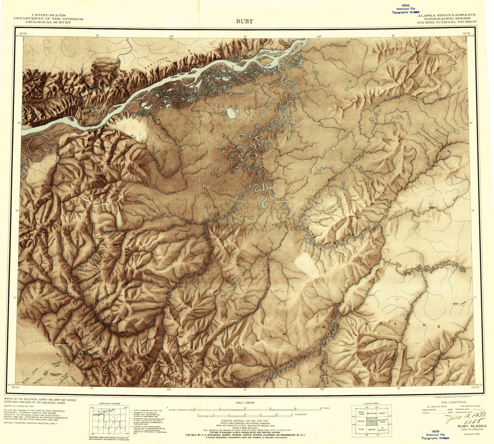
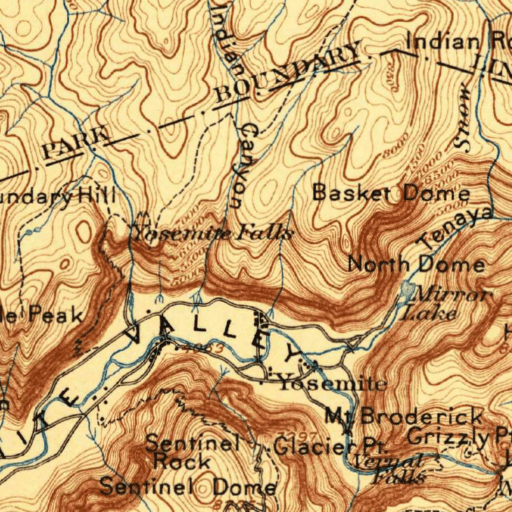

# usgs-topo-tiler

Library to read Web Mercator map tiles from USGS Historical Topographic Maps,
and utilities to create a [MosaicJSON][mosaicjson] collection from these maps.

[mosaicjson]: https://github.com/developmentseed/mosaicjson-spec/

## Overview

I stumbled upon a hidden gem: the entire USGS historical topographic map
archive, consisting of 183112 digitized maps from 1884 to 2006, is stored in
Cloud-Optimized GeoTIFF (COG) format on AWS S3. Incredulously, this fact is
currently unpublicized.

The [COG format][cogeo] is a backwards-compatible, cloud-native storage format
for raster files that allow selected portions of the file to be read over the
network without needing to download and parse the entire file. This fast random
read access allows for dynamic tiling of map tiles on demand, without needing to
preprocess and store any map data.

[cogeo]: https://www.cogeo.org/

There are three parts to serving your own tiles:

- `usgs-topo-tiler`: a library to extract a _single_ Web Mercator tile from _one_ source historical map.
- `usgs-topo-tiler`'s CLI, which helps to construct MosaicJSON files. These files tell `usgs-topo-mosaic` what source files should be combined to create a single Web Mercator tile.
- [`usgs-topo-mosaic`][usgs-topo-mosaic]: a library to use a MosaicJSON file created above to create a seamless mosaic of tiles. This is designed to be deployed with AWS Lambda and AWS API Gateway as a serverless tile endpoint.

[usgs-topo-mosaic]: https://github.com/kylebarron/usgs-topo-mosaic.

### Removing map collars

All of the USGS historical maps have _collars_, regions of space around the map
where metadata is printed. In order to create continuous map tiles from a
collection of these maps, these collars have to be clipped, so that only the map
is showing.



These maps are georeferenced, which means that it's straightforward to remove
the collar when you know the actual bounds contained in the map. However, I've
found that there's no reliable way to determine the bounds on the fly with just
the image and its filename.

While building the mosaic ahead of time, you have access to this information,
but with the usual tiling setup, you'd only have access to the URL and image
while tiling.

To get around this, I apply a "hack" to the MosaicJSON format. Instead of just
encoding a URL string, I encode the url _and_ the bounds of the map as a JSON
string.

**Summary**: when you build a mosaic using the cli in this library, it encodes a
*non-standard MosaicJSON that works well with the `usgs-mosaic-tiler` tiler, but
*isn't necessarily readable by other MosaicJSON tools

## Generate a Web Mercator tile

### Install

```bash
pip install usgs-topo-tiler 'rio-tiler>=2.0a6'
```

### Usage

Here I'll show a quick overview of reading a single mercator tile from a single
USGS historical map. If you're looking for a specific map, the simplest way is
probably to use the [National Map Viewer][nationalmap]. Check the box for
"Historical Topographic Maps", make sure the file format is "GeoTIFF". Click
"Find Products", and then right click "Download" to get the HTTPS url to the
GeoTIFF on S3.

[nationalmap]: https://viewer.nationalmap.gov/basic/

For this demo, I'll make a mercator tile from an 1897 topographic map of
Yosemite Valley.

```py
from usgs_topo_tiler import tile

url = 'https://prd-tnm.s3.amazonaws.com/StagedProducts/Maps/HistoricalTopo/GeoTIFF/CA/CA_Yosemite_299696_1897_125000_geo.tif'
# Mercator tile
x, y, z = 687, 1583, 12

tile, mask = tile(url, x, y, z, tilesize=512)
print(tile.shape)
# (3, 512, 512)
print(mask.shape)
# (512, 512)
```

Create image from tile

```py
from rio_tiler.utils import render

buffer = render(tile, mask, img_format='png')
```

Write image to file

```py
with open('yose_1897.png', 'wb') as f:
    f.write(buffer)
```

You now have a 512x512 png image aligned with the Web Mercator grid.



## Create a MosaicJSON

### Download list of COG files:

```bash
python scripts/list_s3.py \
    --bucket 'prd-tnm' \
    --prefix 'StagedProducts/Maps/HistoricalTopo/GeoTIFF/' \
    --ext '.tif' \
    > data/geotiff_files.txt

> wc -l data/geotiff_files.txt
  183112 data/geotiff_files.txt
```
